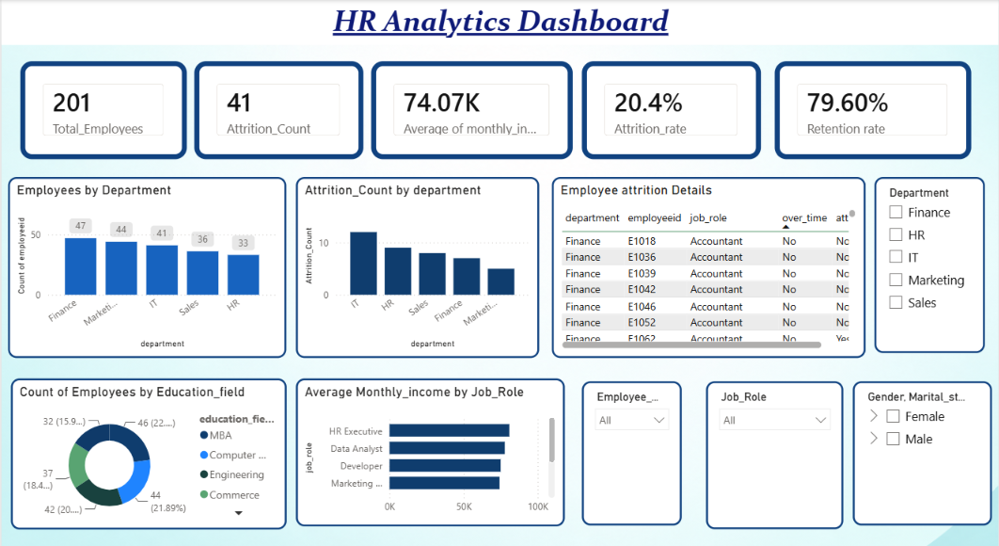
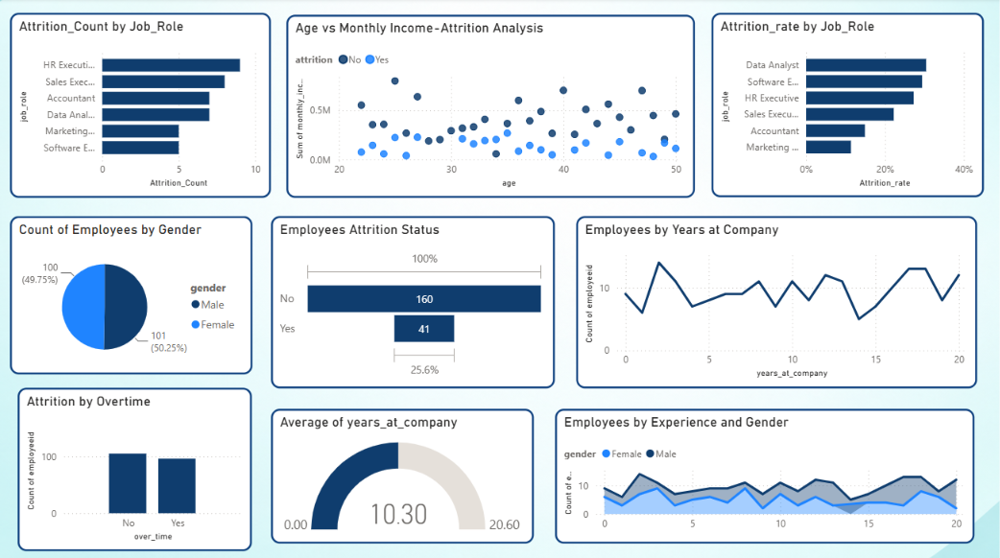

# HR-Analytics-Dashboard
Interactive HR Analytics Dashboard built using Power BI to analyze employee data and identify important HR insights.

# Tools Used
Power BI
Python

# Key Insights
Total Employees:201
Attrition Count:41
Attrition Rate:20.4%
Retention Rate:79.6%
Average Monthly Income:74.07k

# Dashboard
### Page 1

### Page 2

